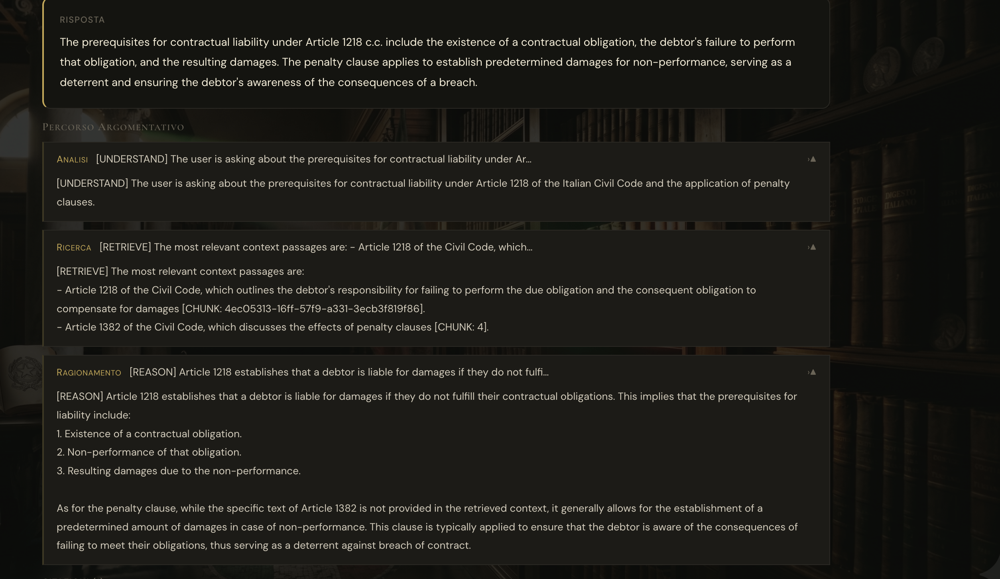
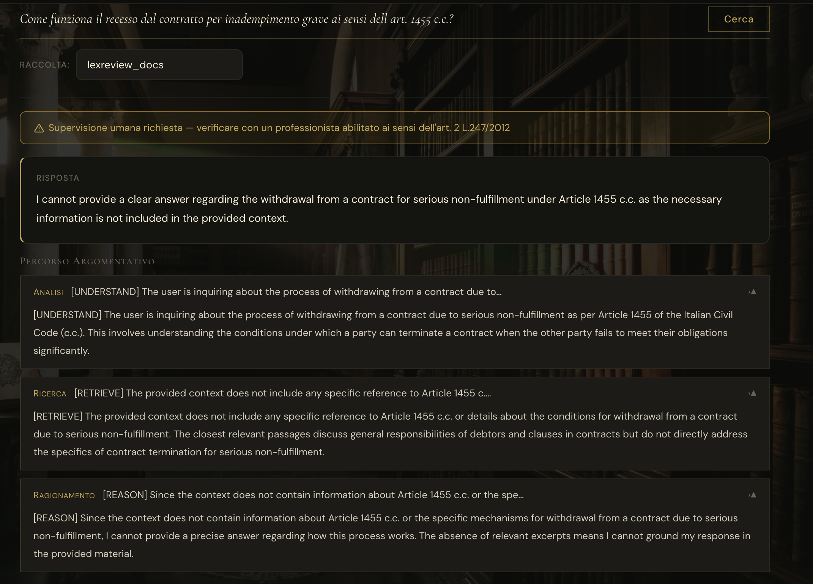
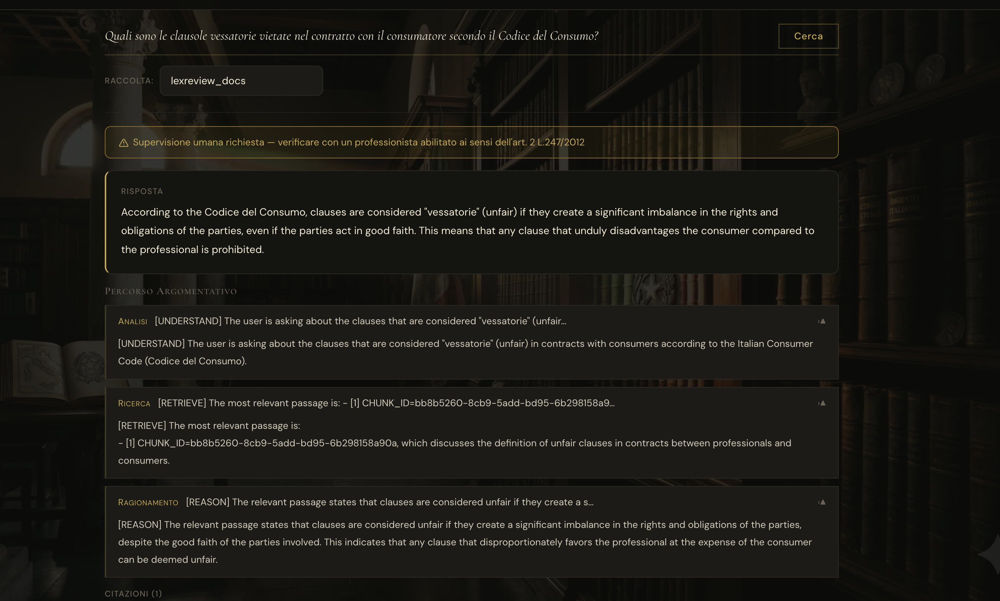
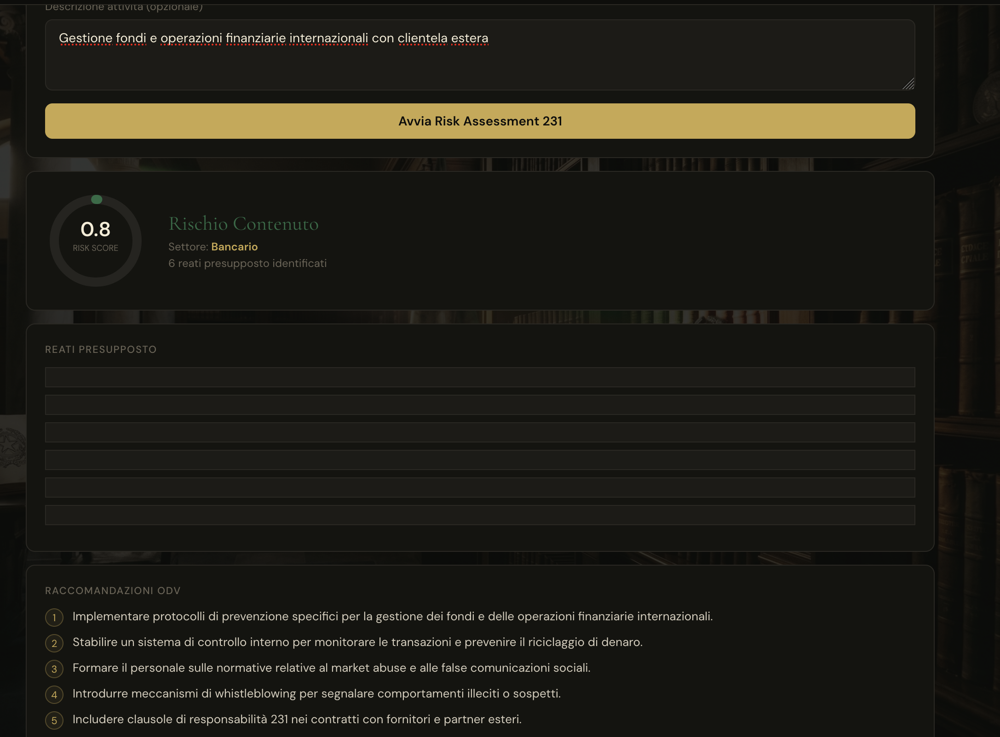
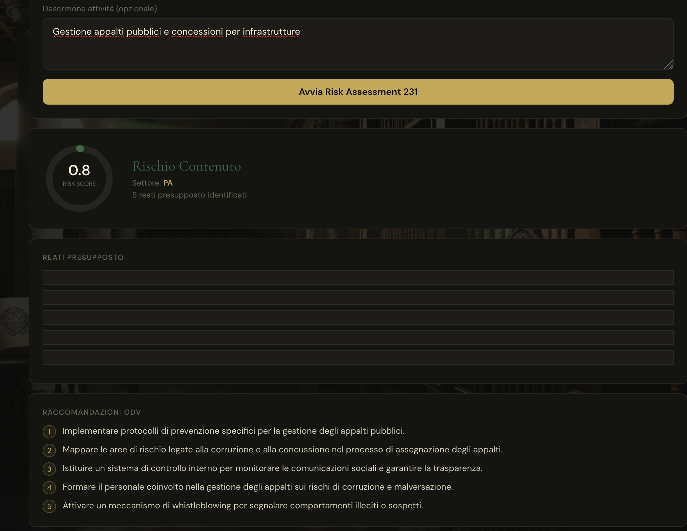

# RAGForge Enterprise

> **Production-grade legal document RAG pipeline — ingestion, hybrid retrieval, reranking, LLM Q&A, NER/clause extraction, and RAG evaluation.**

[](https://www.python.org/)
[](https://fastapi.tiangolo.com/)
[](https://qdrant.tech/)
[](https://github.com/astral-sh/ruff)
[](https://mypy-lang.org/)
[](LICENSE)

RAGForge Enterprise is a production legal RAG pipeline that takes raw PDF contracts and legal documents from ingestion through to grounded LLM answers with citations. The system ships as a fully containerised FastAPI service backed by a Qdrant vector store. The **LexReview** sub-system layers legal-domain intelligence on top of the core retrieval stack: hybrid BM25 + dense retrieval, cross-encoder reranking, OpenAI-powered Q&A, spaCy/regex NER, keyword-based clause detection, and an LLM-as-judge faithfulness evaluator.

## Screenshots








---

## Architecture

```
┌─────────────────────────────────────────────────────────────────────────────┐
│                         RAGForge Enterprise Pipeline                        │
│                                                                             │
│  ┌──────────┐   ┌──────────┐   ┌──────────────────────────────────────┐    │
│  │  PDF     │   │ Loader   │   │ Cleaner                              │    │
│  │  Files   │──▶│ pypdf +  │──▶│ unicode normalisation · page-number  │    │
│  │ (disk/S3)│   │pdfplumber│   │ stripping · boilerplate removal ·   │    │
│  └──────────┘   │ fallback │   │ language detection                  │    │
│                 └──────────┘   └──────────────────────────────────────┘    │
│                                                   │                        │
│                                                   ▼                        │
│                          ┌────────────────────────────────────────────┐    │
│                          │ Chunker (strategy-agnostic)                │    │
│                          │  FixedSize (tiktoken) · Recursive          │    │
│                          │  (separator hierarchy) · Semantic          │    │
│                          │  (sentence-transformers cosine sim)        │    │
│                          └────────────────────────────────────────────┘    │
│                                                   │                        │
│                                                   ▼                        │
│                          ┌────────────────────────────────────────────┐    │
│                          │ Embedding                                  │    │
│                          │  BGEEmbedder  (BAAI/bge-small-en-v1.5)    │    │
│                          │  OpenAIEmbedder  (text-embedding-3-small)  │    │
│                          └────────────────────────────────────────────┘    │
│                                                   │                        │
│                                                   ▼                        │
│                          ┌────────────────────────────────────────────┐    │
│                          │ Qdrant Vector Store                        │    │
│                          │  HNSW index · upsert · similarity search  │    │
│                          └────────────────────────────────────────────┘    │
│                                                   │                        │
│                                                   ▼                        │
│                          ┌────────────────────────────────────────────┐    │
│                          │ Hybrid Retrieval                           │    │
│                          │  BM25 (rank-bm25) ──┐                     │    │
│                          │                     ├─▶ RRF fusion        │    │
│                          │  Dense (Qdrant ANN) ─┘                    │    │
│                          └────────────────────────────────────────────┘    │
│                                                   │                        │
│                                                   ▼                        │
│                          ┌────────────────────────────────────────────┐    │
│                          │ Cross-Encoder Reranker                     │    │
│                          │  cross-encoder/ms-marco-MiniLM-L-6-v2     │    │
│                          └────────────────────────────────────────────┘    │
│                                                   │                        │
│                                                   ▼                        │
│                          ┌────────────────────────────────────────────┐    │
│                          │ LegalRAGAgent — LLM Q&A                   │    │
│                          │  Chain-of-Thought prompting · citations ·  │    │
│                          │  confidence scoring · OpenAI / Ollama      │    │
│                          └────────────────────────────────────────────┘    │
│                                      │                  │                  │
│                                      ▼                  ▼                  │
│              ┌────────────────────────────┐  ┌──────────────────────────┐  │
│              │ NER / Clause Extraction    │  │ RAG Evaluation           │  │
│              │  LegalNER (spaCy)          │  │  FaithfulnessJudge (LLM) │  │
│              │  RegexExtractor            │  │  Precision / Recall /    │  │
│              │  ClauseDetector            │  │  F1 / MRR metrics        │  │
│              └────────────────────────────┘  └──────────────────────────┘  │
└─────────────────────────────────────────────────────────────────────────────┘
```

---

## Project Structure

```
ragforge-enterprise/
├── src/
│   ├── api/
│   │   ├── main.py                 # FastAPI app factory, CORS, lifespan
│   │   ├── dependencies.py         # X-API-Key header authentication
│   │   ├── routers/                # (reserved for future non-LexReview routes)
│   │   └── schemas/                # Shared Pydantic schemas
│   │
│   ├── ingestion/
│   │   ├── loader.py               # PDF loading (pypdf + pdfplumber fallback)
│   │   ├── cleaner.py              # Unicode normalisation, boilerplate removal
│   │   └── chunker.py              # FixedSize, Recursive, Semantic strategies
│   │
│   ├── embedding/
│   │   ├── base.py                 # Abstract embedder interface
│   │   ├── bge_embedder.py         # Local sentence-transformers BGE embedder
│   │   └── openai_embedder.py      # OpenAI-compatible REST embedder
│   │
│   ├── vectorstore/
│   │   ├── base.py                 # Abstract vector store interface
│   │   ├── qdrant_store.py         # Qdrant upsert, search, collection management
│   │   └── schema.py               # IndexedChunk dataclass
│   │
│   ├── retrieval/
│   │   ├── base.py                 # Abstract retriever interface
│   │   ├── dense_retriever.py      # ANN search via Qdrant + embedder
│   │   ├── sparse_retriever.py     # BM25 retrieval (rank-bm25)
│   │   ├── hybrid_retriever.py     # RRF fusion of dense + sparse
│   │   └── reranker.py             # Cross-encoder reranking
│   │
│   ├── indexing/
│   │   └── pipeline.py             # End-to-end ingest: load → clean → chunk → embed → upsert
│   │
│   ├── lexreview/
│   │   ├── api/
│   │   │   ├── router.py           # FastAPI router with all four LexReview endpoints
│   │   │   └── schemas.py          # Request/response Pydantic models
│   │   ├── agent/
│   │   │   ├── legal_rag_agent.py  # LegalRAGAgent: retrieval → rerank → LLM answer
│   │   │   ├── llm_client.py       # OpenAI-compatible LLM client (tenacity retries)
│   │   │   ├── prompts.py          # System and chain-of-thought prompt templates
│   │   │   └── models.py           # AgentResponse, Citation dataclasses
│   │   ├── extraction/
│   │   │   ├── ner.py              # LegalNER — spaCy pipeline wrapper
│   │   │   ├── regex_extractor.py  # Pattern-based date/party/amount extraction
│   │   │   ├── clause_detector.py  # Keyword-based clause classification
│   │   │   └── models.py           # LegalEntities, Clause dataclasses
│   │   ├── eval/
│   │   │   ├── evaluator.py        # Orchestrates full RAG evaluation run
│   │   │   ├── faithfulness.py     # LLM-as-judge faithfulness scorer
│   │   │   ├── metrics.py          # Precision@k, Recall@k, MRR, F1
│   │   │   ├── samples.py          # Evaluation dataset helpers
│   │   │   └── models.py           # EvalResult, EvalReport dataclasses
│   │   └── finetune/
│   │       ├── data_prep.py        # LoRA fine-tune dataset preparation
│   │       └── trainer.py          # PEFT/TRL fine-tune training loop
│   │
│   ├── config/
│   │   └── settings.py             # Pydantic BaseSettings — all tuneable parameters
│   └── utils/
│       └── logger.py               # Structured JSON logging (stdout)
│
├── tests/
│   ├── test_loader.py
│   ├── test_cleaner.py
│   ├── test_chunker.py
│   ├── test_embedder.py
│   ├── test_qdrant_store.py
│   ├── test_indexing_pipeline.py
│   ├── test_phase2_coverage.py
│   └── lexreview/
│       ├── test_agent.py
│       ├── test_api_routes.py
│       ├── test_evaluator.py
│       ├── test_extraction.py
│       └── test_metrics.py
│
├── data/
│   └── sample_docs/                # Input PDFs (git-ignored)
├── notebooks/
│   └── 01_chunking_analysis.ipynb
├── scripts/                        # Utility / one-off scripts
├── Dockerfile
├── docker-compose.yml
├── pyproject.toml
├── .env.example
└── README.md
```

---

## Endpoints

All `/lexreview/*` endpoints require an `X-API-Key` header when `API_KEY` is set in the environment. When `API_KEY` is empty the service runs without authentication (development mode).

Interactive API docs are available at `http://localhost:8000/docs` (Swagger UI) and `http://localhost:8000/redoc` (ReDoc).

| Method | Path | Auth required | Description |
|--------|------|:---:|-------------|
| `POST` | `/lexreview/query` | ✅ | Run the full `HybridRetriever → CrossEncoderReranker → LLM` chain-of-thought pipeline and return a grounded answer with citations. |
| `POST` | `/lexreview/extract` | ✅ | Extract legal entities (parties, dates, amounts) via spaCy NER + regex, and detect standard legal clauses via keyword classification. |
| `POST` | `/lexreview/index` | ✅ | Embed a list of text strings using the configured embedder and upsert them into the specified Qdrant collection. |
| `POST` | `/lexreview/search` | ✅ | Run hybrid BM25 + dense retrieval with optional cross-encoder reranking and return ranked chunks without LLM generation. |
| `GET` | `/health` | ❌ | Returns `{"status": "ok", "service": "ragforge-enterprise"}`. Used by Docker health checks. |

---

## Configuration

All settings are loaded from environment variables or a `.env` file in the project root. Variable names are **case-insensitive**. Unrecognised variables are silently ignored.

| Setting field | Env var | Default | Description |
|---|---|---|---|
| `openai_api_key` | `OPENAI_API_KEY` | _(empty)_ | Required when `EMBEDDING_PROVIDER=openai` or `LLM_PROVIDER=openai`. |
| `qdrant_host` | `QDRANT_HOST` | `localhost` | Hostname of the Qdrant server. Set to `qdrant` inside Docker Compose. |
| `qdrant_port` | `QDRANT_PORT` | `6333` | Qdrant REST API port. |
| `qdrant_collection_name` | `QDRANT_COLLECTION_NAME` | `lexreview_docs` | Default Qdrant collection used by query and search endpoints. |
| `api_key` | `API_KEY` | _(empty)_ | Secret sent in `X-API-Key` header. Leave empty to disable auth in development. |
| `cors_allowed_origins` | `CORS_ALLOWED_ORIGINS` | `http://localhost:3000,http://localhost:8000` | Comma-separated list of allowed CORS origins. |
| `reranker_model` | `RERANKER_MODEL` | `cross-encoder/ms-marco-MiniLM-L-6-v2` | sentence-transformers cross-encoder model for reranking. |
| `reranker_enabled` | `RERANKER_ENABLED` | `true` | Enable cross-encoder reranking in the retrieval pipeline. |
| `embedding_provider` | `EMBEDDING_PROVIDER` | `bge` | Embedder backend: `bge` (local sentence-transformers) or `openai` (REST). |
| `embedding_model` | `EMBEDDING_MODEL` | `BAAI/bge-small-en-v1.5` | HuggingFace model identifier used by the BGE embedder. |
| `llm_model` | `LLM_MODEL` | `gpt-4o-mini` | Chat/completion model name sent to the LLM endpoint. |
| `llm_base_url` | `OPENAI_API_BASE` | `https://api.openai.com/v1` | Base URL for the OpenAI-compatible LLM endpoint. |
| `chunk_size` | `CHUNK_SIZE` | `512` | Target token count per chunk. |
| `chunk_overlap` | `CHUNK_OVERLAP` | `64` | Overlapping tokens between consecutive chunks. |
| `spacy_model` | `SPACY_MODEL` | `en_core_web_sm` | spaCy pipeline loaded by `LegalNER`. |
| `log_level` | `LOG_LEVEL` | `INFO` | Python log level: `DEBUG` \| `INFO` \| `WARNING` \| `ERROR` \| `CRITICAL`. |

See `.env.example` for the full list including HNSW index parameters and fine-tune settings.

---

## Quick Start

### Prerequisites

- Docker ≥ 24 and Docker Compose v2
- An OpenAI API key (required if using the LLM Q&A or OpenAI embedding provider)

### Steps

```bash
# 1. Clone the repository
git clone https://github.com/your-org/ragforge-enterprise.git
cd ragforge-enterprise

# 2. Create your environment file
cp .env.example .env
# Edit .env — at minimum set OPENAI_API_KEY and API_KEY:
#   OPENAI_API_KEY=sk-proj-...
#   API_KEY=my-secret-token

# 3. Start the full stack (Qdrant + FastAPI)
docker compose up -d --build

# 4. Wait for the API to become healthy (~30 s), then verify
curl -s http://localhost:8000/health
# → {"status":"ok","service":"ragforge-enterprise"}

# 5. Index some documents
curl -s -X POST http://localhost:8000/lexreview/index \
  -H "Content-Type: application/json" \
  -H "X-API-Key: my-secret-token" \
  -d '{
    "texts": [
      "The Licensee shall pay royalties of 5% of net revenue on a quarterly basis.",
      "Either party may terminate this Agreement with 30 days written notice."
    ],
    "collection_name": "lexreview_docs"
  }' | python3 -m json.tool

# 6. Query the indexed documents
curl -s -X POST http://localhost:8000/lexreview/query \
  -H "Content-Type: application/json" \
  -H "X-API-Key: my-secret-token" \
  -d '{
    "query": "What are the royalty payment terms?",
    "collection_name": "lexreview_docs"
  }' | python3 -m json.tool
```

To tear the stack down (including volumes):

```bash
docker compose down -v
```

### Local development (without Docker)

```bash
python -m venv .venv
source .venv/bin/activate
pip install -e ".[dev]"
python -m spacy download en_core_web_sm

# Start Qdrant separately (Docker or local binary), then:
uvicorn src.api.main:app --reload --host 0.0.0.0 --port 8000
```

---

## Running Tests

```bash
# Full test suite with coverage (≥ 80 % enforced by CI)
pytest --cov=src --cov-report=term-missing

# Run a specific module
pytest tests/test_chunker.py -v

# Run only LexReview tests
pytest tests/lexreview/ -v

# Generate HTML coverage report
pytest --cov=src --cov-report=html
open htmlcov/index.html
```

The `pyproject.toml` `[tool.pytest.ini_options]` sets `--cov=src --cov-report=term-missing --cov-fail-under=80` as defaults, so a bare `pytest` invocation is equivalent.

---

## Contributing

1. Fork the repository and create a feature branch.
2. Ensure all tests pass: `pytest`.
3. Ensure linting passes: `ruff check src/ tests/`.
4. Ensure type-checking passes: `mypy src/`.
5. Open a pull request with a clear description of the change.

---

## Mercato Italiano (Italian Market)

RAGForge Italia is the Italian-market spin-off of RAGForge Enterprise, targeting
law firms (*studi legali*), magistrates, *notai*, legal publishers (Giuffrè, UTET),
and enterprise compliance teams subject to Italian and EU law.

### 6.1 Deployment & Data Residency

All data must remain on Italian territory, as required by the *segreto professionale*
(professional secrecy) and GDPR data-residency principles.

| Cloud | Region | Notes |
|-------|--------|-------|
| AWS | `eu-south-1` (Milan) | Primary target — 3 AZs, EKS + Qdrant on r6g.xlarge |
| Azure | Italy North | Alternative — AKS + Azure Managed Disks (ZRS) |

**Certification targets:** ISO 27001, SOC 2 Type II, [AgID](https://www.agid.gov.it/) qualification (for PA customers).

**Italian deployment stack:**

```bash
# Start the Italian production profile (Loki + Grafana compliance logging)
docker compose -f docker-compose.yml -f docker-compose.italia.yml --profile italia up -d

# Verify data-residency labels
docker inspect lexreview-api | grep -i "data-residency"
# → "ragforge.data-residency": "IT"
```

See [`docker-compose.italia.yml`](docker-compose.italia.yml) for the full override configuration.

---

### 6.2 API Localisation

All endpoints support Italian error messages and carry a mandatory legal disclaimer.

#### `Accept-Language: it` header

When the client sends `Accept-Language: it` (or `it-IT`), all HTTP error response bodies
return Italian-language messages to meet the expectations of Italian legal professionals:

```bash
curl -H "Accept-Language: it" http://localhost:8000/nonexistent
# → {"detail": "Risorsa non trovata.", "detail_original": "Not Found"}
```

#### `X-Legal-Disclaimer: IT` response header

Every API response includes:

```
X-Legal-Disclaimer: Le risposte fornite hanno carattere informativo e non costituiscono parere legale.
```

This is required by art. 4 D.Lgs. 70/2003 (e-commerce directive transposition) and is
standard practice for AI legal tools operating in Italy.

#### Italian error catalogue

30+ Italian error codes covering:

| Category | Examples |
|----------|---------|
| Standard HTTP | `NOT_FOUND`, `AUTHENTICATION_REQUIRED`, `RATE_LIMIT_EXCEEDED` |
| GDPR | `GDPR_RIGHT_TO_ERASURE` (art. 17), `GDPR_DATA_RESIDENCY_VIOLATION` |
| EU AI Act | `AI_ACT_LOW_CONFIDENCE`, `AI_ACT_HUMAN_OVERSIGHT_REQUIRED` |
| Connectors | `NOTARTEL_UNAVAILABLE`, `SIECIC_READONLY_VIOLATION`, `FILENET_AUTH_ERROR` |
| Webhooks | `WEBHOOK_SIGNATURE_INVALID`, `WEBHOOK_PAYLOAD_INVALID` |

---

### 6.3 Integration Connectors

Phase 6 adds four enterprise integration connectors for Italian legal systems:

| Connector | Source | Mode | Auth |
|-----------|--------|------|------|
| `FilenetDocumentumConnector` | IBM FileNet P8 / OpenText Documentum | Pull (CMIS 1.1) + Push (webhook) | Basic Auth |
| `LexisNexisItaliaConnector` | LexisNexis Italia | Pull (REST) + Push (webhook) | OAuth 2.0 client-credentials |
| `NotartelConnector` | Notartel S.p.A. (Italian notary network) | Pull (REST/XML) + Export | Bearer token |
| `SiecicSicidConnector` | Ministry of Justice SIECIC (civil) / SICID (criminal) | **Read-only** | DGSIA API key |

```python
from src.italia.connectors import INTEGRATION_CONNECTORS

# Notartel (stub mode for development)
connector = INTEGRATION_CONNECTORS["notartel"](token="", stub=True)
atti = connector.fetch()

# Export to Notartel XML
xml = connector.export_to_notartel_xml(atti)

# SIECIC — read court docket
siecic = INTEGRATION_CONNECTORS["siecic"](stub=True)
fascicolo = siecic.fetch_fascicolo(numero="1234", anno="2024", tribunale="Tribunale di Milano")
# Attempting to write raises NotImplementedError (CAD art. 2 compliance)
```

#### Webhook endpoints

```bash
# FileNet push event
curl -X POST http://localhost:8000/italia/webhooks/filenet \
  -H "Content-Type: application/json" \
  -H "X-FileNet-Signature: sha256=<hmac>" \
  -d '{"eventType": "objectCreated", "objectId": "IT-DOC-001", "repositoryId": "FPOS"}'
# → 202 Accepted

# LexisNexis notification
curl -X POST http://localhost:8000/italia/webhooks/lexisnexis \
  -H "Content-Type: application/json" \
  -H "X-LexisNexis-Signature: sha256=<hmac>" \
  -d '{"eventType": "documentUpdated", "id": "LN-IT-12345"}'
# → 202 Accepted
```

#### Connector configuration

Set credentials via environment variables or `.env`:

```bash
# FileNet / Documentum
FILENET_BASE_URL=https://filenet.mybank.it/fncmis/resources
FILENET_REPOSITORY=FPOS
FILENET_USERNAME=svc_ragforge
FILENET_PASSWORD=...
FILENET_WEBHOOK_SECRET=...

# LexisNexis Italia
LEXISNEXIS_CLIENT_ID=...
LEXISNEXIS_CLIENT_SECRET=...
LEXISNEXIS_WEBHOOK_SECRET=...

# Notartel (token from CNN IdP, refreshed every 8h)
NOTARTEL_TOKEN=...
NOTARTEL_STUB=false      # true for development without credentials

# SIECIC / SICID (requires DGSIA formal agreement)
SIECIC_API_KEY=...
SIECIC_STUB=false        # true for development
```

#### Development without credentials (stub mode)

```bash
# Run all Phase 6 tests without any external credentials
NOTARTEL_STUB=true SIECIC_STUB=true pytest tests/italia/test_phase6_infra.py -v
```

---

## License

MIT © RAGForge Team
